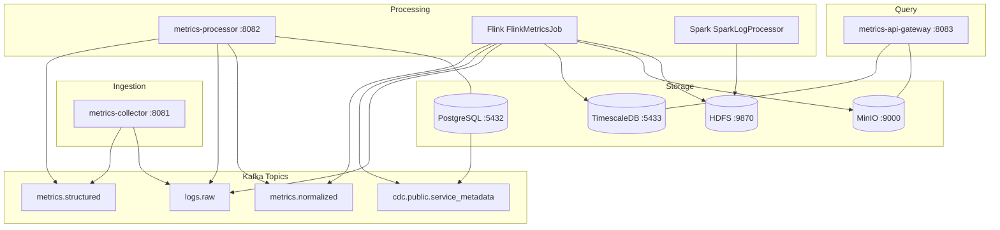

# Distributed Metrics Logging and Aggregation System

A production-ready distributed system for real-time metrics collection, processing, and aggregation using Apache Kafka, Apache Flink, and Spring Boot. Supports both **structured** (JSON, Protobuf, Avro) and **unstructured** (logs, text, binary) data ingestion.

## Prerequisites

- JDK 17+
- Docker & Docker Compose
- Apache Maven 3.8+
- 8GB+ RAM available

## Quick Start

```bash
# Clone repository
git clone https://github.com/your-org/distributed-metrics-system.git
cd distributed-metrics-system

# Start infrastructure services
docker-compose up -d

# Build all modules
mvn clean package

# Start Spring Boot services (3 terminal windows)
cd metrics-collector && mvn spring-boot:run    # port 8081
cd metrics-processor && mvn spring-boot:run    # port 8082
cd metrics-api-gateway && mvn spring-boot:run  # port 8083

# Submit Flink job (both pipelines: structured metrics + raw log archival)
cd metrics-flink-processor
mvn clean package
flink run -c com.metrics.flink.FlinkMetricsJob target/flink-processor-1.0.0.jar

# Submit Spark batch job (converts HDFS raw logs to structured Parquet)
cd metrics-spark-processor
mvn clean package
spark-submit \
  --master spark://localhost:7077 \
  --class com.metrics.spark.SparkLogProcessor \
  target/metrics-spark-processor-1.0.0-SNAPSHOT.jar \
  hdfs://namenode:9000/metrics/logs/raw \
  hdfs://namenode:9000/metrics/logs/parquet
```

## Architecture

The system ingests structured and unstructured data through a five-module pipeline:



## Modules

| Module | Type | Port | Role |
|--------|------|------|------|
| `metrics-collector` | Spring Boot | 8081 | REST ingestion — structured metrics and raw logs |
| `metrics-processor` | Spring Boot | 8082 | Kafka consumer — enriches events from PostgreSQL |
| `metrics-flink-processor` | Flink fat JAR | — | Streaming: windowed aggregation + HDFS log archival |
| `metrics-spark-processor` | Spark fat JAR | — | Batch: regex-parses HDFS logs to structured Parquet |
| `metrics-api-gateway` | Spring Boot | 8083 | Query layer — TimescaleDB time-series + MinIO file listing |

## API Endpoints

### metrics-collector (port 8081)

```
POST /api/v1/metrics            # ingest a single MetricEvent (JSON)
POST /api/v1/metrics/batch      # ingest a batch of MetricEvents (JSON array)
POST /api/v1/logs               # ingest a raw log line (text/plain, ?source=)
POST /api/v1/logs/batch         # ingest a batch of raw log lines (JSON string array)
```

Example metric event:
```json
{
  "metricName": "cpu.usage",
  "value": 75.5,
  "unit": "percent",
  "serviceId": "svc-api",
  "tags": { "host": "host-01", "region": "us-east-1" },
  "timestamp": "2024-01-15T10:30:00Z"
}
```

### metrics-api-gateway (port 8083)

```
GET /api/v1/query/timeseries?metricName=cpu.usage&serviceId=svc-api&from=2024-01-01T00:00:00Z&to=2024-01-02T00:00:00Z
GET /api/v1/query/series?metricName=cpu.usage&serviceId=svc-api&from=2024-01-01T00:00:00Z&to=2024-01-02T00:00:00Z
GET /api/v1/query/files?prefix=aggregated/production/2024-01-15
```

## Kafka Topics

| Topic | Key | Purpose |
|-------|-----|---------|
| `metrics.structured` | `serviceId` | Raw structured metric events from collector |
| `logs.raw` | `source` | Raw unstructured log lines from collector |
| `metrics.normalized` | `serviceId` | Enriched metric events from processor |
| `cdc.public.service_metadata` | — | Debezium CDC events for service metadata |

## Technology Stack

| Component | Technology | Version |
|-----------|------------|---------|
| Application framework | Spring Boot | 3.2.5 |
| Language | Java | 17 |
| Message broker | Apache Kafka (Confluent) | 7.5.0 |
| Stream processor | Apache Flink | 1.18.1 |
| Batch processor | Apache Spark | 3.5.1 |
| Distributed storage | Hadoop HDFS | 3.2.1 |
| Time-series DB | TimescaleDB (PostgreSQL 16) | latest-pg16 |
| Object storage | MinIO | latest |
| Operational DB | PostgreSQL | 16 |
| CDC connector | Debezium | 2.5 |
| Build tool | Apache Maven | 3.8+ |

## Web UIs

| Interface | URL | Credentials |
|-----------|-----|-------------|
| Flink JobManager | http://localhost:8080 | — |
| Kafka UI | http://localhost:8090 | — |
| MinIO Console | http://localhost:9001 | minioadmin / minioadmin |
| HDFS NameNode | http://localhost:9870 | — |
| Spark Master | http://localhost:8888 | — |

> **Security note:** Default credentials are for local development only. See `docs/SECURITY.md` for the full security inventory and production hardening recommendations.

## Documentation

| Document | Description |
|----------|-------------|
| [`docs/ARCHITECTURE.md`](docs/ARCHITECTURE.md) | Module map, system diagram, infrastructure services, Kafka topics, technology versions |
| [`docs/FLOW.md`](docs/FLOW.md) | Sequence diagrams for all four data flows, data models, HDFS and MinIO storage layouts |
| [`docs/DESIGN.md`](docs/DESIGN.md) | Eight design decisions with rationale and trade-offs, technical debt inventory |
| [`docs/SECURITY.md`](docs/SECURITY.md) | Authentication gaps, hardcoded secrets inventory, network exposure matrix, recommendations |
| [`CLAUDE.md`](CLAUDE.md) | Developer guidance for Claude Code — build commands, design summary, DDL notes |

## Running Tests

```bash
# All modules
mvn test

# Single module
mvn test -pl metrics-collector

# Single test class
mvn test -pl metrics-processor -Dtest=LogParserTest

# Spark tests (spins up a local Spark session — requires ~2GB heap)
mvn test -pl metrics-spark-processor
```
