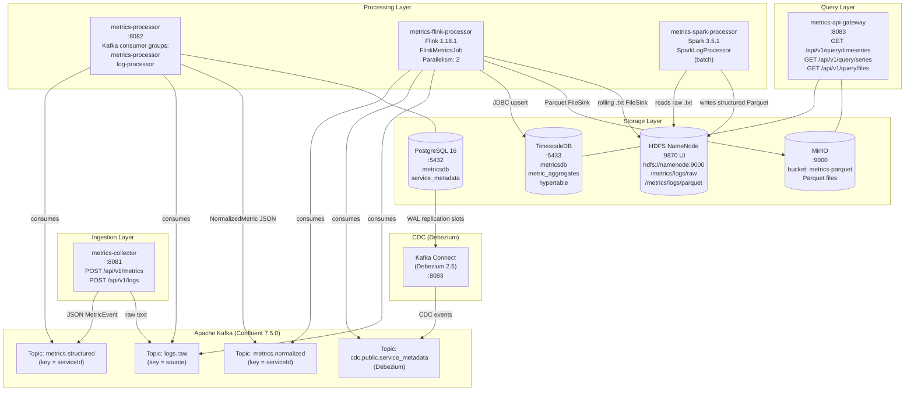
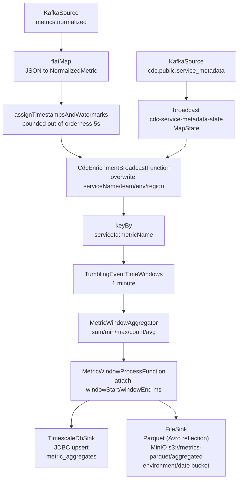
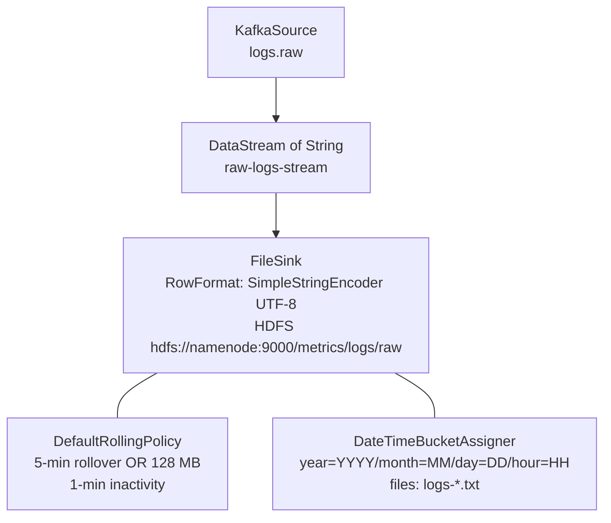

# Architecture

## Overview

The Distributed Metrics Logging and Aggregation System is a multi-module Maven project (`com.metrics:metrics-system:1.0.0-SNAPSHOT`) built on Java 17 and Spring Boot 3.2.5. It ingests both structured metrics (JSON/Avro/Protobuf) and unstructured text logs at high volume, routes all data through Apache Kafka, processes streams in real time with Apache Flink, archives raw logs to HDFS for batch transformation with Apache Spark, and exposes query endpoints over TimescaleDB and MinIO.

## Module Map

| Module | Artifact | Type | Port |
|---|---|---|---|
| `metrics-collector` | Spring Boot JAR | REST ingestion service | 8081 |
| `metrics-processor` | Spring Boot JAR | Kafka consumer / enricher | 8082 |
| `metrics-flink-processor` | Flink fat JAR | Streaming job (two pipelines) | — |
| `metrics-spark-processor` | Spark fat JAR | Batch log structuring job | — |
| `metrics-api-gateway` | Spring Boot JAR | Query layer (TimescaleDB + MinIO) | 8083 |

## System Architecture Diagram

## Module Detail

### metrics-collector (port 8081)

The entry point for all data. Two REST controllers share a single `MetricsPublisherService`:

- `MetricsController` — `POST /api/v1/metrics` (single) and `POST /api/v1/metrics/batch` (list). Deserialises JSON into `MetricEvent`, validates `@NotBlank` / `@NotNull` constraints, serialises to JSON and publishes to `metrics.structured` keyed by `serviceId`.
- `LogIngestionController` — `POST /api/v1/logs` (`text/plain`) and `POST /api/v1/logs/batch` (`application/json`). Publishes raw strings to `logs.raw` keyed by `source` query parameter (default: `http-ingestion`).

Kafka producer is configured in `KafkaProducerConfig` with `acks=all`, idempotence enabled, `linger.ms=5`, `batch.size=65536`, retries=3.

### metrics-processor (port 8082)

A Kafka consumer that handles two independent consumer groups:

- `StructuredMetricsConsumer` (group `metrics-processor`) — reads from `metrics.structured`, enriches via `EnrichmentService`, publishes `NormalizedMetric` to `metrics.normalized`.
- `RawLogConsumer` (group `log-processor`) — reads from `logs.raw`, attempts regex parse via `LogParser`, builds a synthetic `MetricEvent`, enriches with `EnrichmentService`, publishes `NormalizedMetric` to `metrics.normalized`. Non-matching lines are silently dropped.

`EnrichmentService` annotates `resolveMetadata` with `@Cacheable("serviceMetadata")`. The cache is backed by Caffeine (max 500 entries, 10-minute TTL) configured in `KafkaConfig`. The service falls back to default metadata when no `ServiceMetadata` row exists for a `serviceId`.

Database migrations run via Flyway (`V1__init.sql`) against PostgreSQL 16 (`metricsdb`). The `service_metadata` table is the sole persistent entity.

### metrics-flink-processor (Flink fat JAR)

`FlinkMetricsJob.main()` constructs two independent streaming pipelines on the same `StreamExecutionEnvironment` with checkpointing every 60 seconds and default parallelism 2.

**Pipeline 1 — Structured metrics aggregation:**

**Pipeline 2 — Raw log archival:**

### metrics-spark-processor (Spark fat JAR)

`SparkLogProcessor` is a batch job submitted via `spark-submit`. It reads all `.txt` files under the HDFS input path (`/metrics/logs/raw`) recursively, applies `regexp_extract` with the same pattern as `LogParser`, derives a `date` column, drops non-matching lines (empty `timestamp`), and writes Parquet partitioned by `level/date` in `Append` mode to `/metrics/logs/parquet`.

Output Parquet columns: `timestamp`, `level`, `service_id`, `message`, `raw_line`, plus partition columns `date` and `level`.

### metrics-api-gateway (port 8083)

Query layer with two services:

- `TimeSeriesQueryService` — delegates to `AggregatedMetricRepository` which uses `JdbcTemplate` (raw SQL to leverage TimescaleDB's `TIMESTAMPTZ` index). Exposes `GET /api/v1/query/timeseries` (full aggregated rows) and `GET /api/v1/query/series` (lightweight timestamp→avg points).
- `ParquetQueryService` — lists `.parquet` / `.snappy.parquet` objects in MinIO using the MinIO Java SDK (`ListObjectsArgs` with recursive=true). Exposes `GET /api/v1/query/files?prefix=...`.

`MinioConfig` wires the `MinioClient` bean from `application.yml` properties (`minio.endpoint`, `minio.access-key`, `minio.secret-key`).

## Infrastructure Services (docker-compose)

| Container | Image | Exposed Ports | Role |
|---|---|---|---|
| `zookeeper` | confluentinc/cp-zookeeper:7.5.0 | — | Kafka coordination |
| `kafka` | confluentinc/cp-kafka:7.5.0 | 9092 | Message broker |
| `schema-registry` | confluentinc/cp-schema-registry:7.5.0 | 8081 | Avro schema registry |
| `kafka-connect` | debezium/connect:2.5 | 8083 | Debezium CDC connector |
| `postgres` | postgres:16 | 5432 | Operational DB, CDC source |
| `timescaledb` | timescale/timescaledb:latest-pg16 | 5433 | Time-series aggregates |
| `minio` | minio/minio:latest | 9000, 9001 (console) | S3-compatible object store |
| `minio-init` | minio/mc:latest | — | Creates `metrics-parquet` bucket |
| `hadoop-namenode` | bde2020/hadoop-namenode:2.0.0-hadoop3.2.1-java8 | 9870 (Web UI) | HDFS name node |
| `hadoop-datanode` | bde2020/hadoop-datanode:2.0.0-hadoop3.2.1-java8 | — | HDFS data node |
| `hadoop-init` | bde2020/hadoop-namenode | — | Creates HDFS directories |
| `spark-master` | bitnami/spark:3.5 | 8888 (UI), 7077 | Spark master |
| `spark-worker` | bitnami/spark:3.5 | — | Spark worker (2G/2 cores) |
| `flink-jobmanager` | flink:1.18-scala_2.12 | 8080 (UI) | Flink job manager |
| `flink-taskmanager` | flink:1.18-scala_2.12 | — | Flink task manager (4 slots) |
| `kafka-ui` | provectuslabs/kafka-ui:latest | 8090 | Kafka monitoring UI |

All containers share the `metrics-network` bridge network. HDFS NameNode RPC and MinIO both bind port 9000 within their respective containers — there is no host port conflict because only MinIO's 9000 and HDFS's 9870 are mapped to the host.

## Kafka Topics

| Topic | Producer | Consumer(s) | Key | Purpose |
|---|---|---|---|---|
| `metrics.structured` | metrics-collector | metrics-processor | `serviceId` | Raw structured metric events |
| `logs.raw` | metrics-collector | metrics-processor (RawLogConsumer), metrics-flink-processor (Pipeline 2) | `source` | Raw unstructured log lines |
| `metrics.normalized` | metrics-processor | metrics-flink-processor (Pipeline 1) | `serviceId` | Enriched, normalised metric events |
| `cdc.public.service_metadata` | Debezium/kafka-connect | metrics-flink-processor (broadcast) | — | CDC change events for service metadata |

## Technology Versions

| Technology | Version |
|---|---|
| Java | 17 |
| Spring Boot | 3.2.5 |
| Apache Kafka | Confluent 7.5.0 |
| Apache Flink | 1.18.1 |
| Flink Kafka Connector | 3.1.0-1.18 |
| Apache Spark | 3.5.1 (Scala 2.12) |
| Hadoop | 3.3.6 (client), 3.2.1 (HDFS image) |
| Apache Avro | 1.11.3 |
| Apache Parquet | 1.13.1 |
| PostgreSQL | 16 |
| TimescaleDB | latest-pg16 |
| MinIO Java SDK | 8.5.9 |
| Debezium | 2.5 |
| Caffeine | 3.1.8 |
