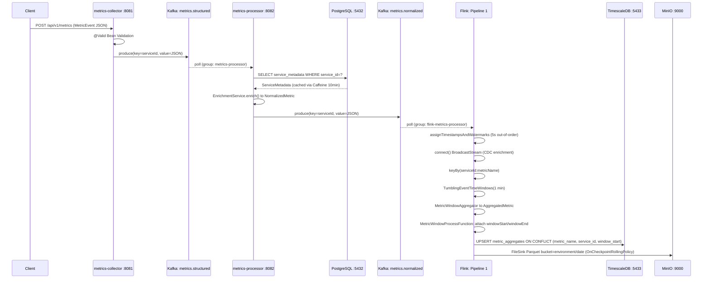
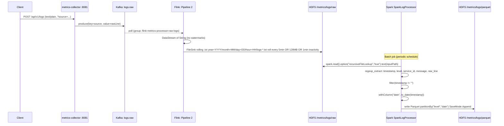
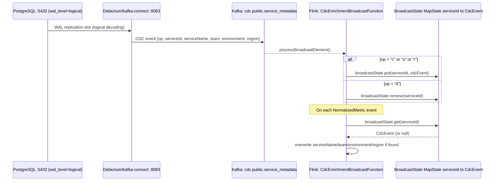
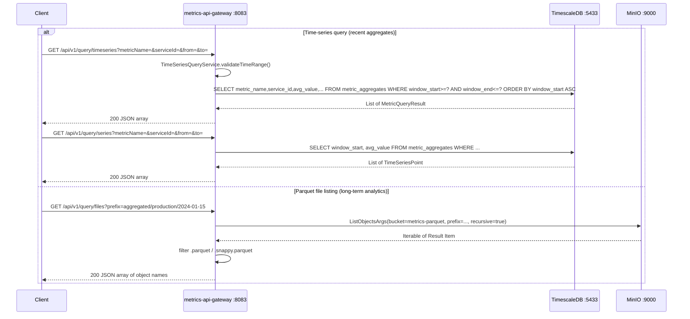
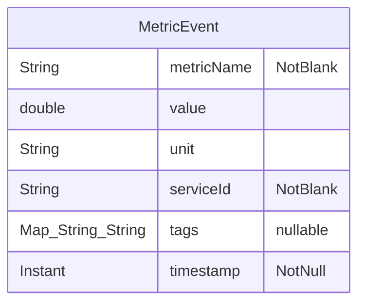
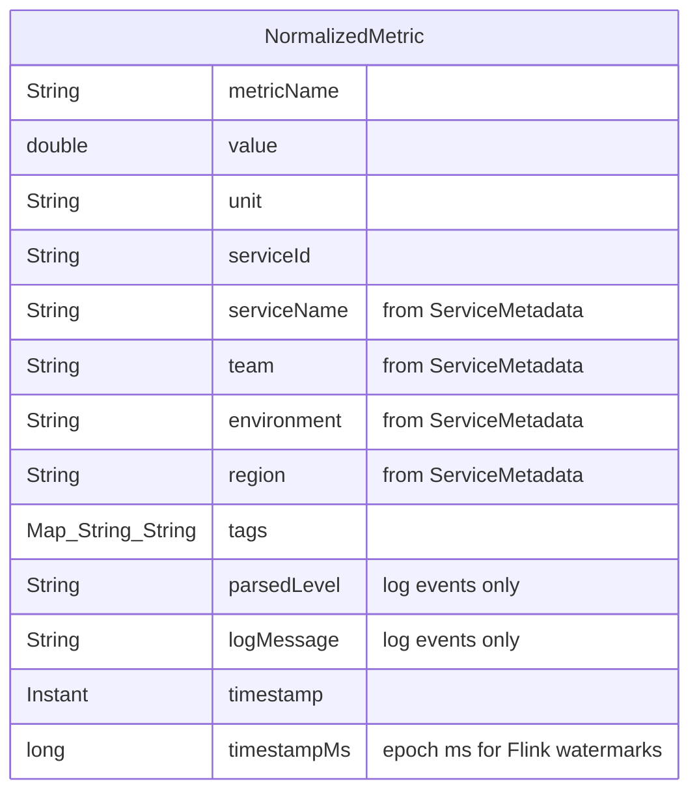
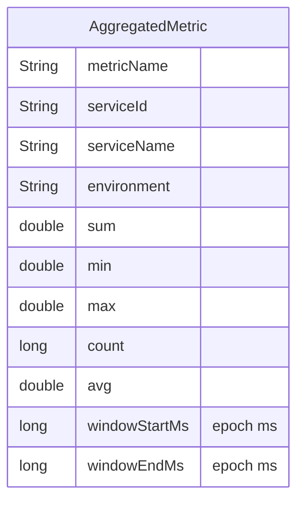
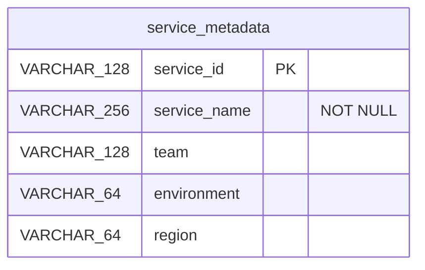
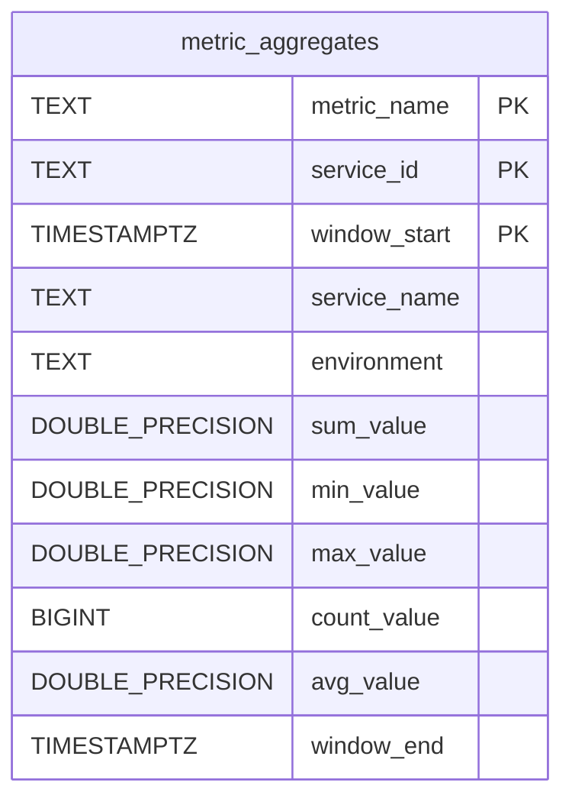
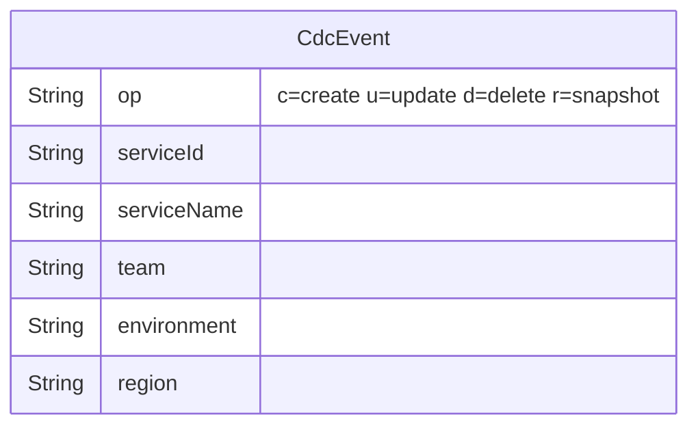

# Data Flow

## End-to-End Pipeline Overview

The system operates two parallel pipelines that diverge at ingestion and converge only at query time:

- **Structured metrics pipeline** — JSON metric events flow from collector → processor (enrichment) → Flink (windowed aggregation) → TimescaleDB + MinIO Parquet.
- **Unstructured log pipeline** — raw text log lines flow from collector → Flink (file archival to HDFS) → Spark (regex structuring → Parquet).

A third, orthogonal CDC stream keeps enrichment metadata in sync across both the Spring-based processor and the Flink broadcast state.

## Structured Metrics Flow



## Unstructured Log Flow



## CDC Enrichment Flow



## Query Flow



## Data Models

### MetricEvent (ingestion payload)



### NormalizedMetric (enriched event on metrics.normalized)



### AggregatedMetric (Flink window output)



### ServiceMetadata (PostgreSQL, Flyway-managed)



### metric_aggregates (TimescaleDB hypertable)



The `metric_aggregates` table is converted to a TimescaleDB hypertable on `window_start` via `SELECT create_hypertable('metric_aggregates', 'window_start', if_not_exists => TRUE)`. This DDL must be run manually before submitting the Flink job (not managed by Flyway).

### CdcEvent (cdc.public.service_metadata topic payload)



## Log Parsing Pattern

Both `LogParser` (metrics-processor) and `SparkLogProcessor` (metrics-spark-processor) use the same regex pattern:

```
(\d{4}-\d{2}-\d{2}T[\d:.]+Z)\s+\[(\w+)]\s+\[([^\]]+)]\s+(.*)
```

Group mapping:
1. ISO-8601 timestamp (e.g. `2024-01-15T10:30:00.123Z`)
2. Log level (e.g. `INFO`, `ERROR`)
3. Service ID (e.g. `svc-api`)
4. Message text

Lines that do not match are silently dropped. In `LogParser` they return `Optional.empty()`; in Spark they are filtered out via `filter(timestamp != "")`.

## HDFS Partition Layout

Raw log files written by Flink (Pipeline 2):
```
hdfs://namenode:9000/metrics/logs/raw/
  year=2024/month=01/day=15/hour=10/
    logs-<uuid>.txt
    logs-<uuid>.txt.inprogress
```

Structured Parquet files written by Spark:
```
hdfs://namenode:9000/metrics/logs/parquet/
  level=INFO/date=2024-01-15/
    part-00000-*.parquet
  level=ERROR/date=2024-01-15/
    part-00000-*.parquet
```

## MinIO Object Layout

Aggregated Parquet files written by Flink (Pipeline 1):
```
s3://metrics-parquet/aggregated/
  production/2024-01-15/
    part-0-<uuid>.parquet
  staging/2024-01-15/
    part-0-<uuid>.parquet
```

Bucket `metrics-parquet` is created with public read policy by the `minio-init` container at startup. Parquet files roll on every Flink checkpoint (`OnCheckpointRollingPolicy`).
